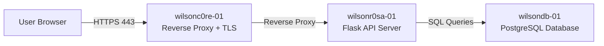

# Hybrid Infrastructure Lab – 3-Tier Linux App Stack

## Overview

This project demonstrates a **secure 3-tier hybrid infrastructure environment** built using Linux virtual machines.

The environment simulates a production-style deployment with:

* TLS termination
* Reverse proxy architecture
* API application service
* Database backend
* Network segmentation

---

# Architecture

The environment consists of three Linux servers:

| Node          | Role                            | IP             |
| ------------- | ------------------------------- | -------------- |
| wilsonc0re-01 | Reverse Proxy / TLS Termination | 192.168.56.101 |
| wilsonr0sa-01 | Application Server (Flask API)  | 192.168.56.102 |
| wilsondb-01   | PostgreSQL Database             | 192.168.56.103 |

Architecture diagram:



---

# Network Design

The lab uses a **dual network interface architecture**.

### Adapter 1 – NAT

Provides internet access for updates and package installation.

### Adapter 2 – Host-Only Network

Used for internal communication between infrastructure nodes.

This creates network segmentation between public access and internal services.

---

# Infrastructure Components

## Reverse Proxy Node (wilsonc0re-01)

Responsibilities:

* TLS termination
* Reverse proxy routing
* HTTPS exposure

Technologies:

* Nginx
* Self-signed TLS certificates
* HTTP → HTTPS redirect

Endpoints exposed:

```
https://192.168.56.101/
https://192.168.56.101/api/health
https://192.168.56.101/api/db
```

---

## Application Server (wilsonr0sa-01)

Responsibilities:

* Application hosting
* API routing
* Proxying to Gunicorn

Technology stack:

* Nginx
* Gunicorn
* Flask

API Endpoints:

| Endpoint    | Function                   |
| ----------- | -------------------------- |
| /api/health | Service health check       |
| /api/db     | Database connectivity test |

Example response:

```
{"node":"wilsonr0sa-01","status":"ok"}
```

---

## Database Server (wilsondb-01)

Database platform:

* PostgreSQL

Database configuration:

```
Database: wilsonapp
User: wilsonappuser
Authentication: SCRAM-SHA-256
Port: 5432
```

Access is restricted using:

* `pg_hba.conf`
* firewall rules

Only the application server is allowed to connect.

---

# Security Controls Implemented

### TLS Termination

HTTPS is enforced using TLS on the reverse proxy node.

```
listen 443 ssl;
```

---

### Network Segmentation

Internal services communicate over a host-only network.

External users access only the proxy node.

---

### Database Access Control

PostgreSQL authentication is restricted via:

```
pg_hba.conf
```

Allowing only the application server IP:

```
192.168.56.102
```

---

# Testing

Health check:

```
curl https://192.168.56.101/api/health
```

Database connectivity:

```
curl https://192.168.56.101/api/db
```

Example output:

```
{"db":"ok","time":"2026-03-04T04:19:56"}
```

---

# Skills Demonstrated

Linux system administration
Nginx reverse proxy configuration
TLS implementation
Flask API deployment
Gunicorn application server
PostgreSQL configuration
Network segmentation
Infrastructure troubleshooting


---

# Creator
Jared Wilson
